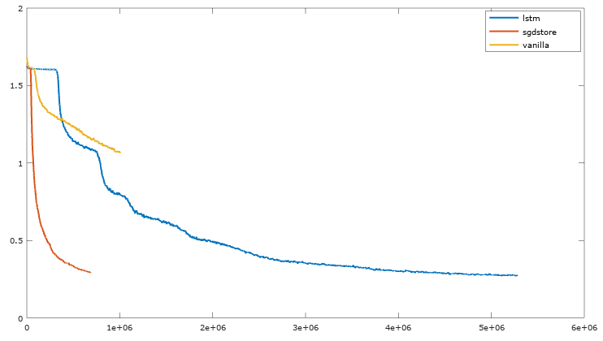
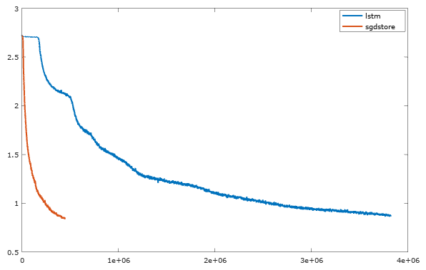
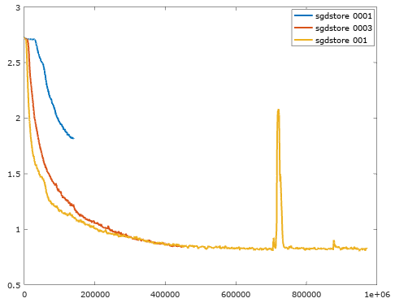
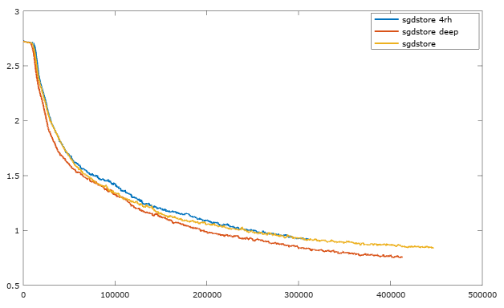

# Omniglot

In an episode of this experiment, the model is presented with a sequence of either 50 or 100 images. It knows beforehand that there are 5 (or 15) different kinds of characters with different labels. However, it does not know what the labels are, nor has it seen the exact characters before. How well can a model learn to do this task, if you train it with enough background knowledge?

# 5-class task

In this task, the sequences are of length 50 and there are 5 different classes. Here are the accuracy numbers for the sgdstore model.

<table>
  <tr>
    <th>Instance 1</th>
    <th>Instance 2</th>
    <th>Instance 3</th>
    <th>Instance 4</th>
    <th>Instance 11</th>
  </tr>
  <tr>
    <td>35.76%</td>
    <td>89.38%</td>
    <td>93.72%</td>
    <td>95.25%</td>
    <td>96.74%</td>
  </tr>
</table>

Note that these results look worse than the results in [Santoro et al.](https://arxiv.org/abs/1605.06065). This is likely due to the fact that I use a different training/evaluation split. In the aforementioned paper, the network is meta-trained on more data and tested on less data. The models I trained did indeed overfit slightly, indicating that more training data would be helpful. I am using the original background/evaluation split from [Lake et al.](http://science.sciencemag.org/content/350/6266/1332).

The following graph shows, for three different models, the validation error over time (measured in episodes) during meta-training. The sgdstore model clearly does the best, but the LSTM catches up after way more training. The vanilla RNN (which is used as a controller for sgdstore), does terribly on its own. I will update the graph after I have run the sgdstore model for longer.

Training in this experiment was done with batch sizes of 64 and a step size of 0.0003. It is likely that hyper-parameter tuning would result in much better results. I discovered in the 15-class task that batches of 16 work much better in terms of data efficiency. I have yet to test larger step sizes, but I bet that will help too.

# 15-class task

In this task, the sequences are of length 100 and there are 15 different classes. Here are the accuracy results for the sgdstore model:

<table>
  <tr>
    <th>Instance 1</th>
    <th>Instance 2</th>
    <th>Instance 3</th>
    <th>Instance 4</th>
    <th>Instance 10</th>
    <th>Instance 11</th>
  </tr>
  <tr>
    <td>9.73%</td>
    <td>77.07%</td>
    <td>84.73%</td>
    <td>87.39%</td>
    <td>87.74%</td>
    <td>90.91%</td>
  </tr>
</table>

Here is a plot of training over time. In this case, I used a batch size of 16 and a learning rate of 0.0003. It is clear that the sgdstore model learns an order of magnitude faster than the LSTM, but once again the LSTM does eventually catch up:

# Hyper-parameter exploration

The above experiments were with a learning rate of 0.0003. From the following graph, it's clear that the model would learn faster (in the short term) with a learning rate of 0.001:

Also, the model in the above experiments were a single MLP with 256 hidden units and two read heads. By "two read heads", I mean that the controller got to run two samples through the memory network. Here are two variations: one with "deep memory" (two layers of 256 units), another with four read heads. It is clear that deep memory helps in the long run, perhaps just due to the extra capacity:

Here are the accuracy measurements for the "deep memory" model:

<table>
  <tr>
    <th>Set</th>
    <th>1st</th>
    <th>2nd</th>
    <th>3rd</th>
    <th>10th</th>
    <th>11th</th>
  </tr>
  <tr>
    <td>Eval</td>
    <td>11.4%</td>
    <td>81.7%</td>
    <td>86.5%</td>
    <td>91.2%</td>
    <td>91.0%</td>
  </tr>
  <tr>
    <td>Train</td>
    <td>13.4%</td>
    <td>88.6%</td>
    <td>92.7%</td>
    <td>95.6%</td>
    <td>96.8%</td>
  </tr>
</table>

# A note on LSTM results

I have found that I can get much better LSTM results than the ones reported in *Santoro et al.*. They stop training after 100,000 episodes, which seems arbitrary (almost like it was chosen to make their model look good, since it learns faster). I don't want to confuse learning speed with model capacity, which *Santoro et al.* seems to do.

I use two-layer LSTMs with 384 cells per layer. This is likely much more capacity than Santoro et al. allow for their LSTMs. I think it would be unfair not to give LSTMs the benefit of the doubt, even if their learning speeds are a lot worse than memory-augmented neural networks.
